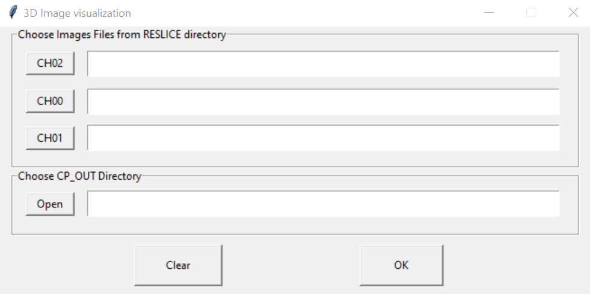

# Snakemake workflow: `3DChromTrans`

[](https://snakemake.github.io)
[](https://github.com/<owner>/<repo>/actions?query=branch%3Amain+workflow%3ATests)


## For measuring distances between two types of markers in [Chromosomal Translocation](https://en.wikipedia.org/wiki/Chromosomal_translocation)

The usage of this workflow is described also in the [Snakemake Workflow Catalog](https://snakemake.github.io/snakemake-workflow-catalog/?usage=<owner>%2F<repo>).

If you use this workflow in a paper, don't forget to give credits to the authors by citing the URL of this (original) `<repo>`sitory and its DOI (see above).


## Image acquisition settings for data generation

The Fluorescence In Situ Hybridization (FISH) assay was carried out
with the following fluorophores:
* Texas Red, Emission Wavelength=614nm
* Alexa Fluor 488, Emission Wavelength=517nm

For nuclei detection, cells were stained with 
* DAPI, Emission Wavelength=465nm

3D multiplex images of whole cells were acquired with ZEISS LMS 980 microscope in Airyscan mode.
* Objective Immersion="Oil" LensNA="1.4"
* Model="Plan-Apochromat 63x/1.4 Oil DIC (UV) VIS-IR M27"
* NominalMagnification="63"
* WorkingDistance="193.0" WorkingDistanceUnit="um"
* Zoom="3.6"
* Voxel Size: 0.073x0.073x0.130 

*NOTE* : Lateral resolution of 0.073 um must be achived

## Installation

You will need a current version of `snakemake` to run this workflow. To get `snakemake` please follow the install [instructions](https://snakemake.readthedocs.io/en/stable/getting_started/installation.html) on their website, but in brief once `conda` and `mamba` are installed you can install `snakemake` with:

```
mamba create -n snakemake -c conda-forge -c bioconda snakemake
```

Afterwards you can activate the `conda` environment and download the repository. And all additional dependencies will be handled by `snakemake`.

```
conda activate snakemake
git clone https://gitlab.linux.crg.es/rgomez/3dchromtrans.git
```

### - For Windows installation

Download and install the following softwares:
* [Fiji/ImageJ](https://fiji.sc/)
* [CellProfiler](https://cellprofiler.org/)
* [R](https://www.r-project.org/)

Configure the PATH as described in `config/README.md` by modifying `config/config.json`. 

### - For Linux installation

Create required environments with:
```
snakemake --core all --use-conda --conda-create-envs-only Data_Analysis
```

## Input

Acquired images should be chromatic corrected before going to workflow execution. 

This can be done by installing and executing `Chromagnon` software [instructions](https://github.com/macronucleus/Chromagnon/releases) on their website

 and set the output as delta vision file format (.dv)


## Running

To execute change current directory to the directory `workflow` where `Snakefile` is located.

```
snakemake --cores all --use-conda Data_Analysis
```

## Output

As an output there are two files `results/Results_in_um_Nuclei.xlsx` which contain the following information about each Nucleus.

* Location_Center_X: Absolute location in X coordinate.
* Location_Center_Y: Absolute location in Y coordinate.
* Location_Center_Z: Absolute location in Z coordinate.
* EquivalentDiameter: According to the measured volume the expected diameter of the corresponding sphere.

All distances combination between the two markers per each nuclei and per image are also provided
* Min_Dist: Minimum distance value coming from all combination of distances between markers.

And `results/Results_in_um_Markers.xlsx` file with the following information about each marker: 

* Location_Center_X: Absolute location in X coordinate.
* Location_Center_Y: Absolute location in Y coordinate.
* Location_Center_Z: Absolute location in Z coordinate.
* Min_Dist2Suf: Minimal distance to the nucleus surface.
* Norm_Dist: Is the Min_Dist2Suf divided by minimal distance from the nuclear center to the suface.

## Report generation

For report generation snakemake required `pygments` module and it can be installed with:
```
pip install pygments
```
 
Afterward you can create a report file with the name *report.html* as the example bellow:
```
snakemake Data_Analysis --report report.html
```

## Visual inspection of the results

For visualization of the results you will need a current version of `napari` as python package, please follow the install [instructions](https://napari.org/stable/tutorials/fundamentals/installation.html) on their website.

Afterwards you can activate the `napari` environment

```
conda activate napari-env
```

Then change current directory to the directory `workflow/scripts` where `3D_visualization.py` is located for script execution.

```
python 3D_visualization.py
```
<p align="center">
  
</p>

<p align="center">
  
</p>


## TODO

* Replace `<owner>` and `<repo>` everywhere in the template (also under .github/workflows) with the correct `<repo>` name and owning user or organization.
* Replace `<name>` with the workflow name (can be the same as `<repo>`).
* Replace `<description>` with a description of what the workflow does.
* The workflow will occur in the snakemake-workflow-catalog once it has been made public. Then the link under "Usage" will point to the usage instructions if `<owner>` and `<repo>` were correctly set.