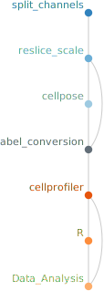
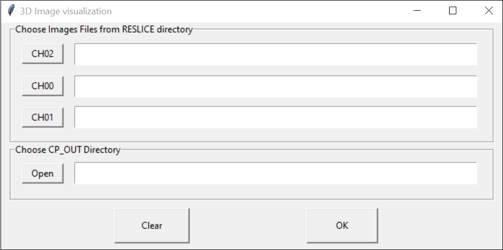

# Snakemake workflow: `3DChromTrans`

[](https://snakemake.github.io)


## Measure distances between two types of markers during [FISH Assay](https://www.pnas.org/doi/abs/10.1073/pnas.79.14.4381) after [Chromosomal Translocation](https://www.ncbi.nlm.nih.gov/pmc/articles/PMC6337718/) event

## Author

* [Raul Gomez Riera](https://orcid.org/0000-0003-4197-180X)

If you use this workflow in a paper, don't forget to give credits to the author by citing the URL of this repo.


## Image acquisition settings for data generation

The Fluorescence In Situ Hybridization (FISH) assay was carried out
with the following fluorophores:
* Texas Red, Emission Wavelength=614nm
* Alexa Fluor 488, Emission Wavelength=517nm

For nuclei detection, cells were stained with 
* DAPI, Emission Wavelength=465nm

3D multiplex images of whole cells were acquired with ZEISS LMS 980 microscope in Airyscan mode.
* Objective Immersion="Oil" LensNA="1.4"
* Model="Plan-Apochromat 63x/1.4 Oil DIC (UV) VIS-IR M27"
* NominalMagnification="63"
* WorkingDistance="193.0" WorkingDistanceUnit="um"
* Zoom="3.6"
* Voxel Size: 0.073x0.073x0.130 um

*NOTE* : Lateral resolution of 0.073 um must be achived

## Installation

You will need a current version of `snakemake` on Linux OS to run this workflow. To get `snakemake` please follow the install [instructions](https://snakemake.readthedocs.io/en/stable/getting_started/installation.html) on their website, but in brief once `conda` and `mamba` are installed you can install `snakemake` with:

```
mamba create -n snakemake -c conda-forge -c bioconda snakemake
```

Afterwards you can activate the `conda` environment and download the repository. And all additional dependencies will be handled by `snakemake`.

```
conda activate snakemake
git clone https://github.com/rgomez-AI/3DChromTrans.git
```


Create required environments by going to the directory `3DChromTrans/workflow` 

where `Snakefile` is located and execute the following command:
```
snakemake --cores all --use-conda --conda-create-envs-only Data_Analysis
```

## Workflow Diagram

<p align="center">
  
</p>

| Component         | Script                                 |    Description                                                  |
|-------------------|----------------------------------------|-----------------------------------------------------------------|
| split_channels    | DVsplit_headless.ijm                   |  Convert .DV file into .TIF file per channel                    |
| reslice_scale     | ResliceZandScale_headless.ijm          |  Make isotropic the 3D space by image interpolation             |
| cellpose          | cellpose                               |  Detect and create nuclei mask                                  |
| label_conversion  | LabelConversions_headless.ijm          |  Convert nuclei mask into labeled image                         |  
| cellprofiler      | 3D_Distance_LowResolution.cppipe       |  Detect and provide the coordinates per nucleus of both markers |
| R                 | DataAnalysis_headless.R                |  Calculate all possible distance combinations between markers   |
| DataAnalysis      | labeled2Dist_headless.ijm              |  Generate 3D distance maps for visual inspection of the results |


## Input

Acquired images should be chromatic corrected before going to workflow execution. 

This can be done by installing and executing `Chromagnon` software [instructions](https://github.com/macronucleus/Chromagnon/releases) on their website

 and set the output as delta vision file format (.dv)

Sample dataset provided by Anna Oncins is an image of Mantle cell lymphoma: [download](https://public-docs.crg.es/almu/rgomez/Anna_Oncins/Dataset.zip)

## Running

To execute change current directory to the directory `workflow` where `Snakefile` is located.

```
snakemake --cores all --use-conda Data_Analysis
```

## Output

As an output there are two files `results/Results_in_um_Nuclei.xlsx` which contain the following information about each Nucleus.

* Location_Center_X: Absolute location in X coordinate.
* Location_Center_Y: Absolute location in Y coordinate.
* Location_Center_Z: Absolute location in Z coordinate.
* EquivalentDiameter: According to the measured volume the expected diameter of the corresponding sphere.

All distances combination between the two markers per each nuclei and per image are also provided
* Min_Dist: Minimum distance value coming from all combination of distances between markers.

And `results/Results_in_um_Markers.xlsx` file with the following information about each marker: 

* Location_Center_X: Absolute location in X coordinate.
* Location_Center_Y: Absolute location in Y coordinate.
* Location_Center_Z: Absolute location in Z coordinate.
* Min_Dist2Suf: Minimal distance to the nucleus surface.
* Norm_Dist: Is the Min_Dist2Suf divided by minimal distance from the nuclear center to the suface.

## Report generation

For report generation snakemake required `pygments` module and it can be installed with:
```
pip install pygments
```
 
Afterward you can create a report file with the name *report.html* as the example bellow:
```
snakemake Data_Analysis --report report.html
```

## Visual inspection of the results

For visualization of the results you will need a current version of `napari` in a new enviroment, please follow the install [instructions](https://napari.org/stable/tutorials/fundamentals/installation.html) on their website.

Afterwards you can activate the `napari` environment

```
conda activate napari-env
```

Then install openpyxl library to read/write Excel 2010 xlsx/xlsm/xltx/xltm files.

```
conda install anaconda::openpyxl
```

Change your current location to the directory `workflow/scripts` where `3D_visualization.py` is located for script execution.

```
python 3D_visualization.py
```
Choose as input : 
* Each channel image located at `workflow/RESLICE` directory
* Results located at `workflow/CP_OUT` directory

<p align="center">
  
</p>

<p align="center">
  
</p>
